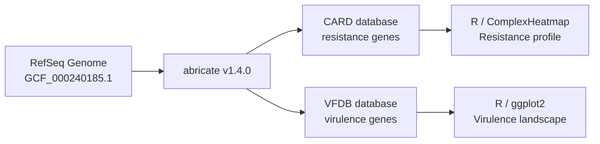
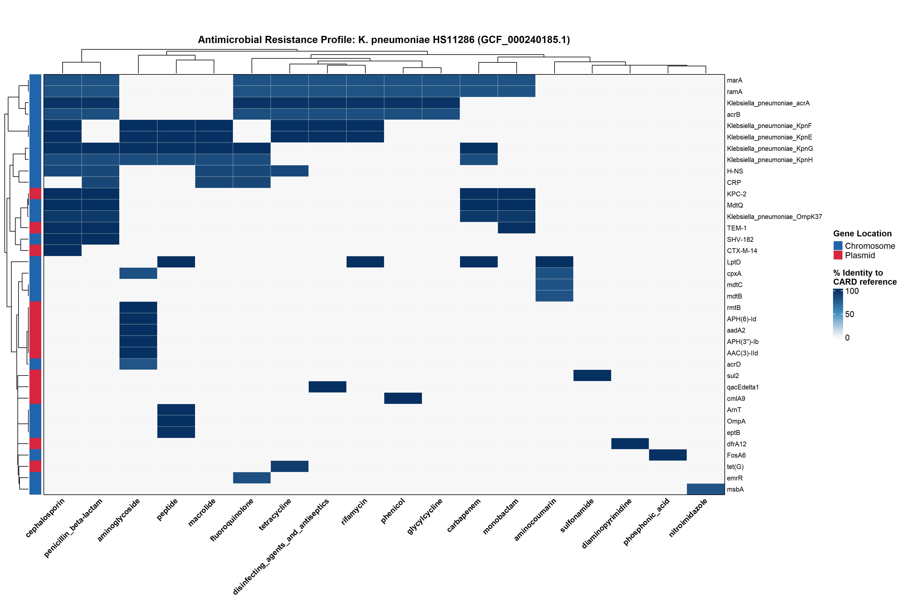
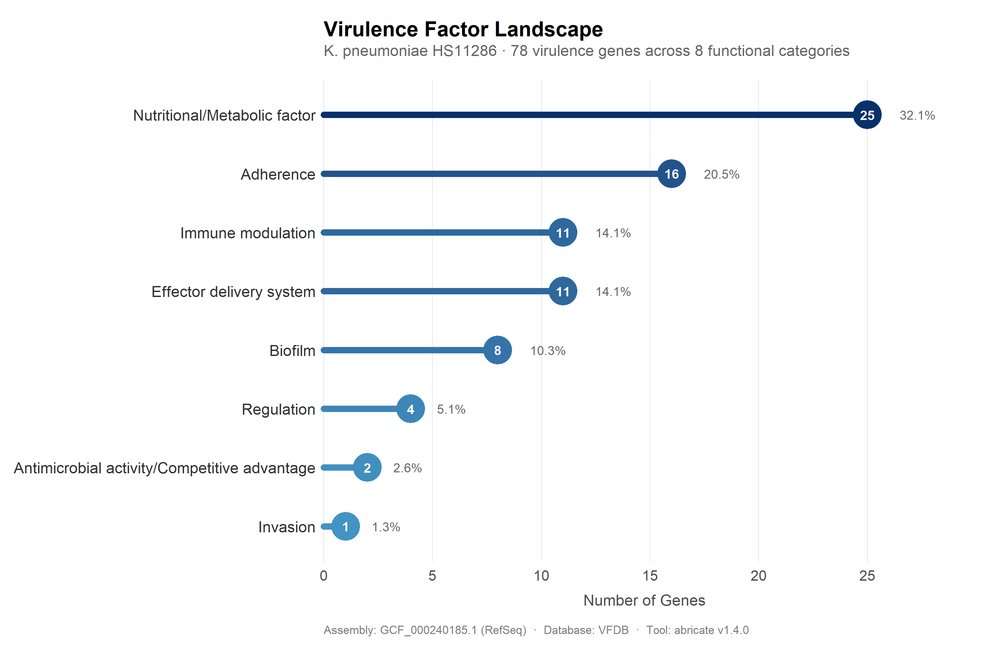

# Clinical AMR & Virulence Gene Profiling — *Klebsiella pneumoniae* HS11286

Genome-wide screening of a carbapenem-resistant *K. pneumoniae* clinical isolate for
antimicrobial resistance and virulence determinants, using publicly available RefSeq
genome data and the CARD / VFDB reference databases.

## Pipeline



## Quick Start

```bash
mamba install -c bioconda -c conda-forge abricate -y
abricate --db card genome.fasta > amr_results.tsv
abricate --db vfdb genome.fasta > virulence_results.tsv
```
Visualization scripts: `scripts/amr_heatmap.R`, `scripts/vfdb_lollipop.R`

## Results

### Antimicrobial Resistance Profile


37 unique resistance genes across 18 antibiotic classes. Notably carries **KPC-2**
(carbapenemase, 100% identity), classifying this isolate as carbapenem-resistant
*K. pneumoniae* (CRKP) — a WHO-priority pathogen. Plasmid-borne genes (KPC-2, CTX-M-14,
TEM-1, rmtB) represent acquired resistance; chromosomal genes (acrAB, mdtBC, KpnEFGH)
are intrinsic efflux systems present across the species.

### Virulence Factor Landscape


78 virulence genes across 8 functional categories. The largest category (32.1%) is
nutritional/metabolic factors, dominated by the enterobactin and aerobactin
iron-scavenging systems — associated with invasive infection severity in the literature.

## Clinical Interpretation

Whole-genome screening of *Klebsiella pneumoniae* subsp. *pneumoniae* HS11286 (RefSeq
assembly GCF_000240185.1) against the CARD database identified 37 unique antimicrobial
resistance genes spanning 18 antibiotic classes, and screening against VFDB identified
78 virulence-associated genes across 8 functional categories.

**Resistance profile.** The genome carries a clinically significant carbapenemase gene,
**KPC-2** (100% identity, 100% coverage to the CARD reference), classifying this isolate
as carbapenem-resistant *K. pneumoniae* (CRKP) — a WHO-priority pathogen given the
limited treatment options once carbapenem resistance is established. This co-occurs
with three extended-spectrum beta-lactamase genes (**CTX-M-14, TEM-1, SHV-182**) and
**rmtB**, a 16S rRNA methyltransferase conferring resistance to the entire aminoglycoside
class rather than a single agent — together indicating a multidrug-resistant phenotype
spanning beta-lactams, aminoglycosides, sulfonamides, and tetracyclines.

Location analysis (13 plasmid-borne vs. 24 chromosomal genes) shows a clear functional
split: the acquired resistance determinants (KPC-2, CTX-M-14, TEM-1, rmtB, sul2, tet(G))
are plasmid-encoded, consistent with horizontal acquisition, while broad-spectrum efflux
systems (acrAB, mdtBC, KpnEFGH) are chromosomally encoded, intrinsic to the species, and
contribute background resistance across multiple drug classes rather than representing
newly acquired threats.

**Virulence profile.** The largest virulence category (25/78 genes, 32.1%) relates to
nutritional/metabolic factors, dominated by the enterobactin siderophore system
(entA–F, fepA–G, entS) and the aerobactin receptor iutA — iron-scavenging systems
associated with invasive *K. pneumoniae* infection severity in the literature. Adherence
factors (16 genes, 20.5%, including the *ecp* pilus operon) and immune-modulation/
effector-delivery genes (11 each, 14.1%) were also well represented.

**Caveats.** This analysis reflects presence/absence and sequence identity of known
reference genes only; it does not assess gene expression, regulatory context, or in
vitro phenotypic susceptibility. Antibiotic susceptibility testing (AST) remains the
gold standard for clinical treatment decisions — this genomic screen should be
interpreted as a predictive/exploratory tool, not a replacement for AST.

## Data Source

- **Organism:** *Klebsiella pneumoniae* subsp. *pneumoniae* HS11286
- **Assembly:** [GCF_000240185.1](https://www.ncbi.nlm.nih.gov/datasets/genome/GCF_000240185.1/) (RefSeq, complete genome)
- Genome FASTA not included in this repository (available via the NCBI link above)

## Tools & Versions

- `abricate` v1.4.0
- Databases: CARD (2026-Apr-3), VFDB (2026-Apr-3)
- R: `ComplexHeatmap`, `ggplot2`, `dplyr`, `tidyr`

## Repository Structure

```
├── README.md
├── environment_versions.txt
├── notebook.ipynb              # Colab notebook — abricate runs
├── scripts/
│   ├── amr_heatmap.R
│   └── vfdb_lollipop.R
└── results/
    ├── amr_results.tsv
    ├── virulence_results.tsv
    ├── AMR_Heatmap_KPneumoniae_HS11286.pdf / .png
    └── VFDB_Virulence_LollipopChart.pdf / .png
```
